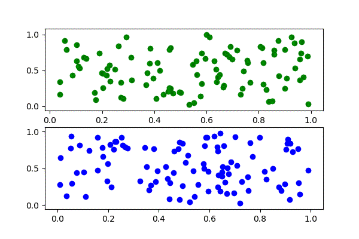

|travis| |python| |license|

.. |travis| image:: https://travis-ci.com/julesy89/pyrecorder.svg?branch=master
   :alt: build status
   :target: https://travis-ci.com/julesy/pyrecorder

.. |python| image:: https://img.shields.io/badge/python-3.6-blue.svg
   :alt: python 3.6

.. |license| image:: https://img.shields.io/badge/license-apache-orange.svg
   :alt: license apache
   :target: https://www.apache.org/licenses/LICENSE-2.0

|logo|

You can find the detailed documentation here: https://www.egr.msu.edu/coinlab/blankjul/pyrecorder/

Installation
============

The framework is available at the PyPi Repository:

.. code-block:: bash

    pip install -U pyrecorder

Usage
=====

It's as simple as it should be. Initialize a `Video` object with a `Recorder` and record the current
plots by calling `record()`. Finally, close the video object with `close()` and you are good to go
and watch your video.

.. code-block:: bash

    import numpy as np
    import matplotlib.pyplot as plt

    from pyrecorder.recorders.file import File
    from pyrecorder.video import Video

    fname = "video.mp4"
    vid = Video(File(fname))

    for k in range(10):
        fig, (ax1, ax2) = plt.subplots(2)

        X = np.random.random((100, 2))
        ax1.scatter(X[:, 0], X[:, 1], color="green")

        X = np.random.random((100, 2))
        ax2.scatter(X[:, 0], X[:, 1], color="red")

        vid.record(fig=fig)

    vid.close()

|animation|

Contact
=======

Feel free to contact me if you have any question:

::

    Julian Blank (blankjul [at] egr.msu.edu)
    Michigan State University
    Computational Optimization and Innovation Laboratory (COIN)
    East Lansing, MI 48824, USA

